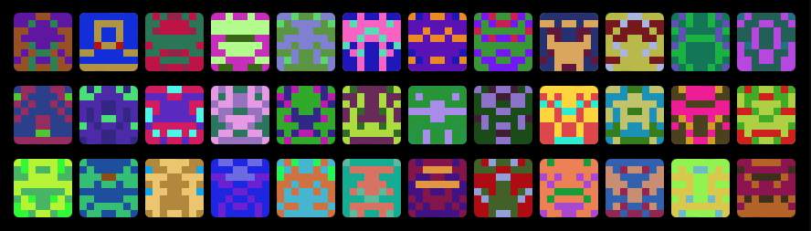

# go-blockies

A go implementation of [Alex Van de Sande's ethereum-blockies](https://github.com/ethereum/blockies) javascript library. These are not meant to replace user profiles, but as security icons, to allow the user to more easily check if an address he wants to interact with is the correct one. The symmetrical aspect of the icons allow our brain see [faces or objects](https://en.wikipedia.org/wiki/Pareidolia), making the icon more recognizable.



## Use

### Default options

```go
  r := chi.NewRouter()
  r.Get("/identicon/{address}", func(w http.ResponseWriter, req *http.Request) {
		w.Header().Set("Content-Type", "image/svg+xml")
		address := chi.URLParam(req, "address")
		blockie := blockies.New(address, nil)
		blockie.Write(w)
	})
```

### Custom options

_All options are optional. For consistent results with other services/apps (e.g etherscan) use defaults._

```go
  r := chi.NewRouter()
  r.Get("/identicon/{address}", func(w http.ResponseWriter, req *http.Request) {
		w.Header().Set("Content-Type", "image/svg+xml")
		address := chi.URLParam(req, "address")
		blockie := blockies.New(address, &blockies.Options{
      Size: 15,
      Scale: 3,
      Color: "#ff0000",
      BgColor: "#00ff00",
      SpotColor: "#0000ff",
    })
		blockie.Write(w)
	})
```

In the above example the icon will be 15x15 blocks, and each block will be 3x3 pixels. The icon canvas will be 45x45 pixels.

## Notes

The defaults of size 8 and scale 4 generate 32x32 pixel icons. Below are some standard sizes that work well. A size larger than 10 will start generating more noisy icons that don't ressemble much.

- 24x24 `{size: 8, scale: 3}`
- 50x50 `{size: 5, scale: 10}`

## License

[WTFPL](http://www.wtfpl.net/)
